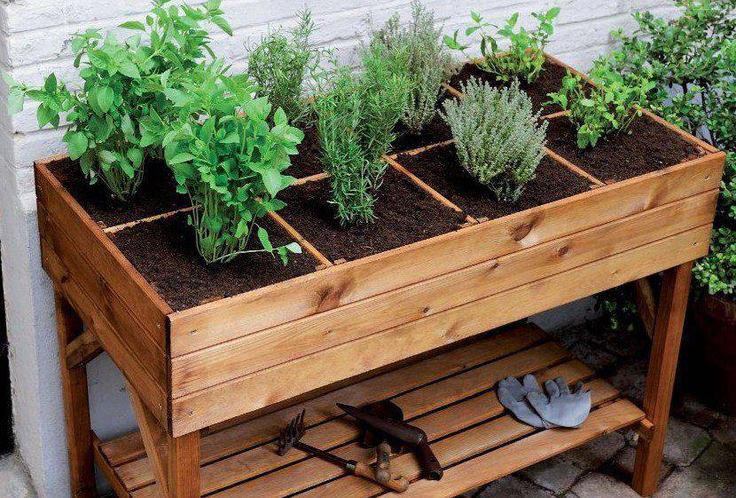
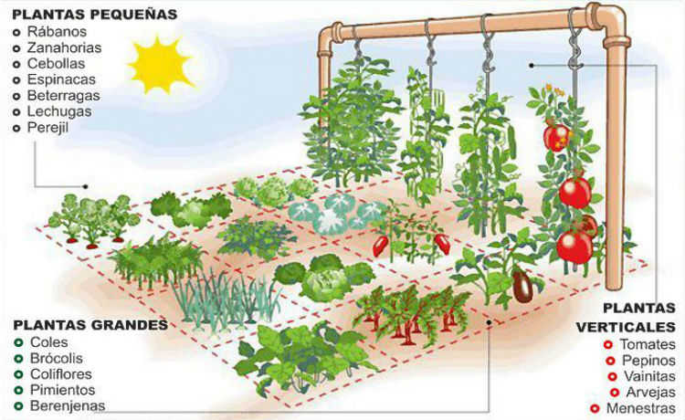

# Horta-automatizada
<h1>Descri&ccedil;&atilde;o</h1>      

Esse projeto ira apresentar uma horta automatizada que pode ser implementado em varios tipos de hortas diferentes(tradicional,domestica,mini horta,organica,suspensa).Com um sistema de irriga&ccedil;&atilde;o automatico por sensor de humidade e com auxilio de luz artificial com a ausencia do sol.

<h1>Pr&eacute;-requisitos</h1>

Para realizar o projeto &eacute; necess&aacute;rio que o programador fa&ccedil;a a instala&ccedil;&atilde;o da IDE do arduino no site&nbsp;<a href="http://www.arduino.cc/" rel="nofollow">www.arduino.cc</a>&nbsp;e o diagrama foi feito no site&nbsp; <a href="https://fritzing.org/home/" target="_blank" rel="noopener">https://fritzing.org/home/</a>&nbsp;.

<h1>Instala&ccedil;&atilde;o</h1>

O diferencial desse projeto &eacute; que ele pode ser aplicado em ambientes pequenos como um apartamento,ou em uma varanda por exemplo.Vantagem desse projeto &eacute; de que o controle de humidade ajuda a economizar agua evitando desperdicio desnecessario de agua,pois quando chove n&atilde;o &eacute; necessario regar a planta.Por isso o sensor de humidade tem que ser bem instalado,em um local mais proximo da planta&ccedil;&atilde;o.Outro sensor que tambem tem que ser bem instalado &eacute; e o de luminosidade LDR,que precisa ser instalado pra atuar na ausencia do sol,por isso a luz artifical,que pode ser uma lampada de LED,tem que estar distante desse sensor,pois caso o contrario ele a lampada tambem vai atuar o sensor.Sera instalado tambem proximo do arduino um bot&atilde;o que desativa essa luz artificial.No acionamento da eletrovalvula pode ser colocado uma mangueira, uma tubulação de agua ou qualquer outro tipo de distribuição de agua,isso fica criterio da  pessoa que esta instalando. 

<h1>Exemplos de onde pode ser instalado</h1>

<h1>Materiais</h1>